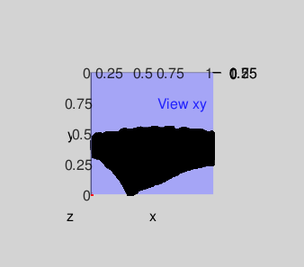
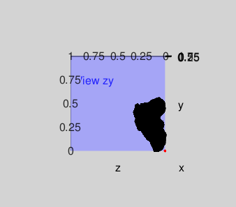
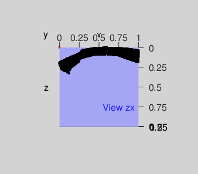

<br>
# Configuration


```r
# Style adapted from http://stat545.com/bit006_github-browsability-wins.html#source-code
#
# TO RENDER THIS AS HTML:
#   setwd( '~/Dropbox/Projects/Potsherd/example' )
#   library('rmarkdown')
#   rmarkdown::render('demonstration.R')

source( 'functions_basic.R' )
source( 'functions_contour.R' )
source( 'configuration.R' )
source( 'cache_cfg.R' )
source( 'cache_model.R' )


view <- function( not_used, vp ) rgl.viewpoint(
    theta = vp$get()$theta
  , phi = vp$get()$phi
  , fov = vp$get()$fov
  , zoom = vp$get()$zoom
)

adjust <- function( parameter, val ){
  cfg$set( parameter, val )
  view( cfg )
}

background <- function( not_used, bgcolor ) bg3d( bgcolor )

see <- function( obj, limits=c(0,1) ) plot3d( obj, xlim = limits , ylim = limits , zlim = limits ) %>% view( cfg )

reference_point <- function( not_used, coords=c(0,0,0), ref_color='red' ) points3d( coords[1], coords[2], coords[3], col = ref_color )

move_it <- function( obj, dx, dy, dz ) assign( obj, translate3d( obj=obj, x=dx, y=dy, z=dz ), envir = .GlobalEnv )
```

# Demonstration


```r
filename %>% load_model() -> model

cfg <- configuration( list( theta=-90, phi=-2, fov=25, zoom=1 )  )

model    %>% center() %>% see() %>% background( 'grey' ) %>% reference_point()
 


see( model ) %>%
  reference_point()


see( model, limits=c(-1,1)) %>%
  reference_point( coords=c(0.75,0.75,0.75), ref_color='red')


# Move the model into the corner and then display it
squared_model <- name_axes(
  translate3d(
      center( model )
    , x=0, y=0, z=0.4
  )
)
see( squared_model )
rgl.viewpoint( theta=-90,phi=-2,fov=25,zoom=1)

squared_model <- name_axes(
  center(
  #  clip_at( 
    rotate3d(
        squared_model
      , 20*pi/180,x=1,y=0,z=0
    )
  )
)
see( squared_model )
rgl.viewpoint( theta=-90,phi=-2,fov=25,zoom=1)


#make_figure( 1, model )
#make_figure( 2, model, 'xy' )
#make_figure( 3, model, 'zy' )
#make_figure( 4, model, 'zx' )
```

#### Oblique view of the prototype potsherd


#### Front and Side Views




#### Top view



### Observations
+ The model scale does not reflect any real-world measurement units and will need to be adjusted
+ The side view reveals that the rim is not parallel with the X-Z plane. In order for measurement in the direction of the Y-axis to represent height of the pot, it will be necessary to rotate the model slightly about the X-axis.  
+ From the top view, it is apparent that the center of the pot lies somewhere in the vicinity of ( 0.6, 0.6 )
<br>


### Adjust the model to be plum, level, and square with the X-, Y-, and Z-axes 
The profile, **P**, comprises points $p_0, p_1, p_2, ... p_n$, which lie on the perimeter of the pot
<br>
Each point, $p_i$, has coordinates (h,r)
<br>
h is the height, the vertical distance above base plane X-Z
<br>
r is the radius, the horizontal distance from the axis of rotation, $r=\sqrt{ (x(h)-x_0)^2+(z(h)-z_0)^2 }$
<br>
<br>
The axis of rotation is perpendicular to the X-Z plane, intersecting it at point **$O_0$**$(x_0,z_0)$
<br>
Point **O** is at the intersection of rays $\overrightarrow{OA}$ and $\overrightarrow{OB}$
<br>
The coordinates of $x_0$ and $z_0$ are estimated as the mean(x) and mean(z) for an arbitrarily-selected number of approximate center points **O**(h)
<br>
Points **A**(h) and **B**(h) are any two points along the perimeter at the same height above the base.
<br>

<br>

<br>

<br>

<br>

---
title: "demonstration.R"
author: "Karl"
date: "Mon Sep 25 11:40:56 2017"
---
