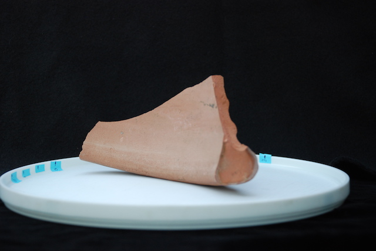
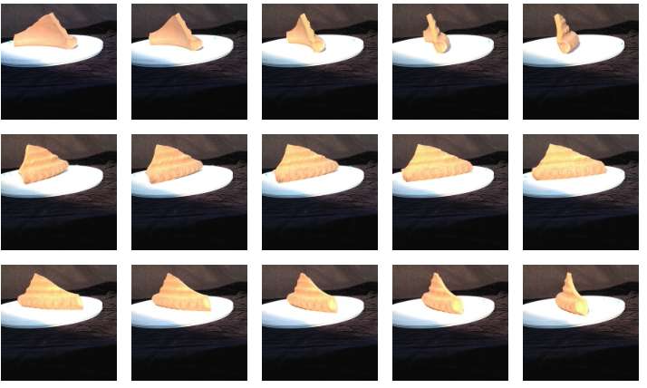

## Data Acquisition -- Photography

### You will need:

* One or more potsherds to measure
* Location with plenty of natural light. See [photography guidelines](https://homes.esat.kuleuven.be/~visit3d/webservice/v2/manual3.php#SEC2)
* Work table
* Camera
* Tripod
* Turntable
* Dark background

### Prepare the photography area as follows:

* Put dark paper or cloth under and behind the turntable to serve as a backdrop
* Adjust the height of the camera on the tripod so the center of the lense is at the same height as the center of the artifact to be photographed

### Photograph each artifact

* Place the pot (or potsherd) on the turntable.
* Even though the accompanying photo does not illustrate this, prop the artifact so that the rim of the pot is parallel to the turntable (Rim up or rim down is not so important)
* To minimize distortion, place the artifact so that the center of the rim (or base) is approximately on the center of the turntable
* Take a series of photographs at roughly 10-degree intervals, resulting in 36 images per artifact

