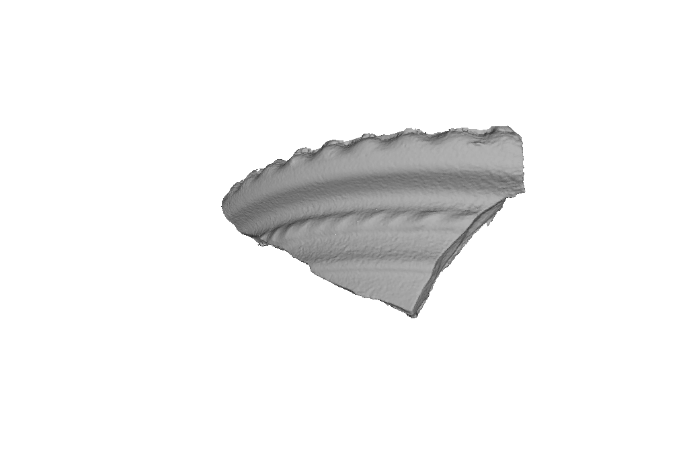

## Data Acquisition -- Three-Dimensional Model

image files --> textured mesh --> stereolithography

### You will need:

* ARC3D Account
    * If you are not already an ARC3D user, apply for a free account [here](https://homes.esat.kuleuven.be/~visit3d/webservice/v2/request_login.php)

* [meshconv](http://www.patrickmin.com/meshconv/) utility

### Convert the image files to a textured mesh
* Upload images to ARC3D web service
* Pour yourself a cup of coffee
* In a few minutes to a few hours, if all goes well, ARC3D will send you a textured mesh object

### Convert the textured mesh to a stereolithography model
* Using the conversion utility, **meshconv**,
* Convert the input file obtained from ARC3D, e.g. **textured_mesh.obj** 
* Into a stereolithography file **-c stl**
* And save the results in a file called **-o stereolithograph[.stl]**

Putting it all together, enter the following command into a terminal window:

$\ \ $__./meshconv textured_mesh.obj -c stl -o stereolithograph__
