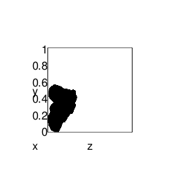
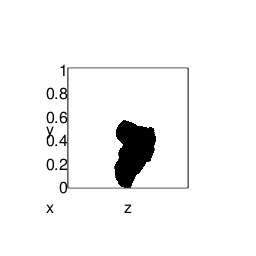
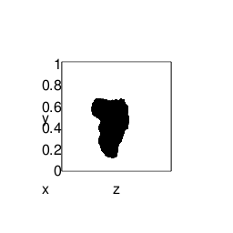
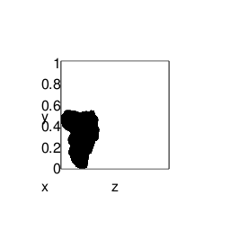
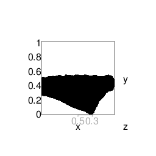
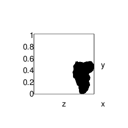
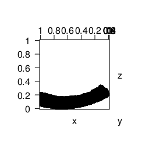

# Computer-Assisted Potsherd Classification

#### [Top](../README.md)

Build a usable model from a stereolithography file
--------------------------------------------------

### Read Stereolithography

``` r
STEREOLITHOGRAPHY_FILE %>%
  load_data() -> raw_data
     make_model( raw_data ) -> model        # Read the stereolithography file and create a model
```

Align the model in the reference frame
--------------------------------------

##### ( For now, this is a manually-initiated action; Eventually, it will be automatic )

#### Push the model into a corner

``` r
model$move_backward( 4.5 )                  # The prototype potsherd model isn't tight against the origin
offset <- apply( model$get(), 2, min )      # Find the distance from each axis to the nearest model point
model$move_left(     offset[ 'x' ] )        # Remove the offset, effectively pushing the object
model$move_down(     offset[ 'y' ] )        # into the corner
model$move_backward( offset[ 'z' ] )
model$show( LEFT_VIEW )                     # Create the first of three figures shown below
make_figure( './images/initial_view' )        # and include it in this document
```



#### Move the model away from the left wall

``` r
model$move_right(   0.4 )                   # Move the model away from the X-Y plane, so
model$move_forward( 0.4 )                   # there will be space to rotate it
model$show( LEFT_VIEW )                     # Create the second figure
make_figure( './images/second_view' )                # and include it in this document
```



#### Tilt the model so the rim is parallel to the X-Z plane

``` r
model$rotate_about_x( 15 )                  # Make the rim parallel with the X-Z plane
model$show( LEFT_VIEW )                     # Create the third figure
make_figure( './images/third_view' )                 # and include it in this document
```



#### Scoot the object tight against each axis again

``` r
offset <- apply( model$get(), 2, min )     
model$move_left( offset[ 'x' ] )
model$move_down( offset[ 'y' ] )
model$move_backward( offset[ 'z' ] )
model$show( LEFT_VIEW )
make_figure( './images/end_view_1' )
```



### Show the model from various vantage points

``` r
model$show( FRONT_VIEW )
axis3d( 'x' )
make_figure( './images/front_view' )
                                            #
model$show( TOP_VIEW_C )
make_figure( './images/top_view' )
                                            #
model$show( RIGHT_VIEW )
make_figure( './images/end_view_2' )
                                            #
```







### Save the Model

``` r
saveRDS( model$get(), MODEL_FILE )
```

#### [Top](../README.md)
