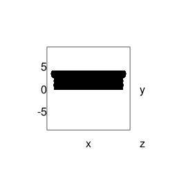
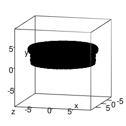
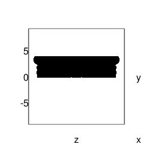
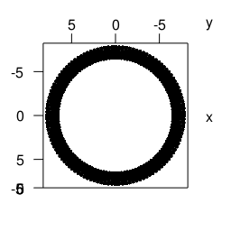

# Computer-Assisted Potsherd Classification

#### [Top](../README.md)

#### Get data from previous step

``` r
radii   <- readRDS( file = 'radii.RDS' )
medians <- radii %>% map_dbl( ~median( . ))
center  <- medians[ 2:3 ]
model   <- make_model( readRDS( MODEL_FILE ) )
vp      <- viewpoint( list( theta = 15, phi = 10, fov = 0, zoom = 0.75 ))
best_x  <- best_slice( model$get(), X_AXIS )
best_x
```

    ## [1] 0.275

``` r
model$get_band( ax=X_AXIS, ctr=best_x, thickness=STRIPE_WIDTH )
model$show( LEFT_VIEW )
make_figure( 'band_1' )
```


``` r
# --
```

#### Square the model in the reference frame

``` r
offset <- apply( model$get(), 2, min )      # Find the distance from each axis to the nearest model point
model$move_left(     offset[ 'x' ] )        # Remove the offset, effectively pushing the object
model$move_down(     offset[ 'y' ] )        # into the corner
model$move_backward( offset[ 'z' ] )
model$show( LEFT_VIEW )
```

#### Flip profile

``` r
# move z-width backward, then rotate about y
offset <- apply( model$get(), 2, max ) 
model$move_backward( offset[ 'z' ] )
model$show( TOP_VIEW_A )
model$rotate_about_y( 90 )
model$show( LEFT_VIEW )
model$show( FRONT_VIEW )
model$move_right( medians[ 'r' ] )
model$show( FRONT_VIEW )
model$scale_it( SCALE_FACTOR )
model$show( FRONT_VIEW, limits=c( -SCALE_FACTOR, SCALE_FACTOR ))
profile_to_wireframe( model$get(), 3 )
```

#### Make figures

``` r
make_figure( 'band_3' )
```



``` r
adjust( vp, 'theta', 15 )
adjust( vp, 'phi', 10 )
make_figure( 'wireframe' )
```



``` r
adjust( vp, 'theta', 90 )
adjust( vp, 'phi', 0 )
make_figure( 'wireframe_side' )
```



``` r
adjust( vp, 'theta', 90 )
adjust( vp, 'phi', 90 )
make_figure( 'wireframe_top' )
```


<br>

References
----------

The style for this document has been adapted from http://stat545.com/bit006\_github-browsability-wins.html\#source-code

#### [Top](../README.md)
