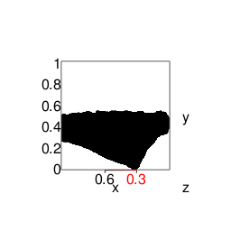

# Computer-Assisted Potsherd Classification

#### [Top](../README.md)

### Get data from previous step

``` r
radii   <- readRDS( file = 'radii.RDS' )
medians <- radii %>% map_dbl( ~median( . ))
center  <- medians[ 2:3 ]
model   <- make_model( readRDS( MODEL_FILE ) )
vp      <- viewpoint( list( theta = 15, phi = 10, fov = 0, zoom = 0.75 ))
```

### Find the tallest cross-section

Recall that the front view looks like this:



``` r
best_x  <- best_slice( model$get(), X_AXIS )
```

The tallest cross-section is at X = `0.3`

### Slice the model at this point


The slice is thick in the Z-direction
We are interested in the points along the outside of the pot,
so find the most dense cloud of points, and keep only that
very thin slice of the band.

``` r
model_data        <- model$get()
histogram_buckets <- model_data[ , 'x'] %>% hist( plot = FALSE )
best_mid          <- as.list( histogram_buckets )[[ 'mids' ]][ which.max( histogram_buckets$counts ) ]
thin_slice        <- as.data.frame( get_band( model_data, 1, best_mid ))
```


### How far apart are the ridges?

``` r
# Establish plot limits
plot_limit_lo <- round( min( thin_slice[ , 'y' ] ), 3 )
plot_limit_hi <- round( max( thin_slice[ , 'y' ] ), 3 )
```

``` r
df <- thin_slice[ ,c( 'y', 'z' ) ]
df <- unique( df[ order( df[ , 'y' ] ), ] )
df <- df[ df[ ,'y' ] > plot_limit_lo & df[ , 'y' ] < plot_limit_hi, ]
extrema <- critical_points( df, 0.001 )
extrema <- extrema[ extrema[ , 'direction' ] %in% 'ridge', ]

p <- ggplot( df, aes( x = z, y = y )) +
  geom_point() +
  expand_limits( x = plot_limit_hi , y = plot_limit_hi )

u <- ( seq( nrow(extrema)) %>% map( ~geom_hline( yintercept = extrema[ ., 'y' ], colour = 'red', linetype=2) ) )
v <- ( seq( nrow(extrema)) %>% map( ~geom_vline( xintercept = extrema[ ., 'z' ], colour = 'red', linetype=2) ) )

# Two of the ridges have nearly the same radius;
# suppress the label for one to make the other label visible
HIDE_CLOSE_LABELS <- c( 1, 3 ) 

g <- round( extrema[ , 'y' ], 3 )
breaks_y <- g - g[ 1 ]
h <- sort( round( extrema[ , 'z' ], 3 ))
breaks_x <- h[ 3 ] - h
breaks_x <- breaks_x[ 1 ]
```


### Rotate the idealized profile to envision the whole pot

#### Square the model in the reference frame

``` r
offset <- apply( model$get(), 2, min )      # Find the distance from each axis to the nearest model point
model$move_left(     offset[ 'x' ] )        # Remove the offset, effectively pushing the object
model$move_down(     offset[ 'y' ] )        # into the corner
model$move_backward( offset[ 'z' ] )
model$show( LEFT_VIEW )
```

#### Flip profile

``` r
# move z-width backward, then rotate about y
offset <- apply( model$get(), 2, max ) 
model$move_backward( offset[ 'z' ] )
model$show( TOP_VIEW_A )
model$rotate_about_y( 90 )
model$show( LEFT_VIEW )
model$show( FRONT_VIEW )
model$move_right( medians[ 'r' ] )
model$show( FRONT_VIEW )
model$scale_it( SCALE_FACTOR )
model$show( FRONT_VIEW, limits=c( -SCALE_FACTOR, SCALE_FACTOR ))
profile_to_wireframe( model$get(), 3 )
```

#### Make figures

``` r
make_figure( 'band_3' )
```


``` r
adjust( vp, 'theta', 15 )
adjust( vp, 'phi', 10 )
make_figure( 'wireframe' )
```


``` r
adjust( vp, 'theta', 90 )
adjust( vp, 'phi', 0 )
make_figure( 'wireframe_side' )
```


``` r
adjust( vp, 'theta', 90 )
adjust( vp, 'phi', 90 )
make_figure( 'wireframe_top' )
```


<br>

References
----------

The style for this document has been adapted from http://stat545.com/bit006\_github-browsability-wins.html\#source-code

#### [Top](../README.md)
