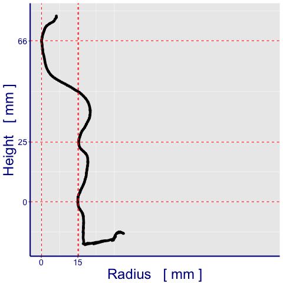
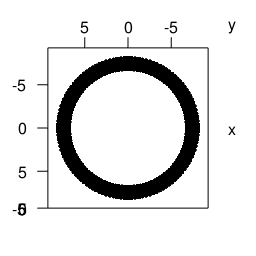

# Computer-Assisted Potsherd Classification

#### [Top](../README.md)

#### Get data from previous step

``` r
radii   <- readRDS( file = 'radii.RDS' )
medians <- radii %>% map_dbl( ~median( . ))
center  <- medians[ 2:3 ]
model   <- make_model( readRDS( MODEL_FILE ) )
vp      <- viewpoint( list( theta = 15, phi = 10, fov = 0, zoom = 0.75 ))

# Find the tallest cross-section
best_x  <- best_slice( model$get(), X_AXIS )
```

The tallest cross-section is at X = `best_x`

``` r
# Slice the model at this point
model$get_band( ax = X_AXIS, ctr = best_x, thickness =  1.8 * STRIPE_WIDTH )
##model$show( LEFT_VIEW )
##make_figure( 'band_1' )

# The slice is thick in the Z-direction
# We are interested in the points along the outside of the pot,
# so find the most dense cloud of points, and keep only that
# very thin slice of the band
model_data        <- model$get()
histogram_buckets <- model_data[ , 'x'] %>% hist( plot = FALSE )
best_mid          <- as.list( histogram_buckets )[[ 'mids' ]][ which.max( histogram_buckets$counts ) ]
thin_slice        <- as.data.frame( get_band( model_data, 1, best_mid ))
# Show the resulting profile
# _____ Begin Plotting _____
  png( './images/band_1.png' )
    ggplot( thin_slice, aes( x = z, y = y )) +
      geom_point()   +
      xlim( 0, 0.6 ) +
      ylim( 0, 0.6 )
  dev.off()
```

    ## quartz_off_screen 
    ##                 2

``` r
# _____ End Plotting _____
```


``` r
CUSTOM_LIMITS_FOR_THIS_POTSHERD <- c(
    round( min(thin_slice[ ,'y']),3)
  , round( max(thin_slice[ ,'y']),3)
)

#c( 0.1, 0.6 )
df <- thin_slice[ ,c( 'y', 'z' ) ]
df <- unique( df[ order( df[ , 'y' ] ), ] )
df <- df[ df[ ,'y' ] > CUSTOM_LIMITS_FOR_THIS_POTSHERD[ 1 ] & df[ , 'y' ] < CUSTOM_LIMITS_FOR_THIS_POTSHERD[ 2 ], ]

extrema <- critical_points( df, 0.001 )

###extrema <- extrema[ !extrema[ , 'direction' ] %in% c('rising','falling'), ]
###extrema <- extrema[ extrema[ , 'direction' ] %in% c( 'ridge', 'groove' ), ]
extrema <- extrema[ extrema[ , 'direction' ] %in% 'ridge', ]

# _____ Begin Plotting _____
png( './images/sliver.png' )
p <- ggplot( df, aes( x = z, y = y )) +
  geom_point() +
  expand_limits( x = CUSTOM_LIMITS_FOR_THIS_POTSHERD[ 2 ] , y = CUSTOM_LIMITS_FOR_THIS_POTSHERD[ 2 ] )

u <- ( seq( nrow(extrema)) %>% map( ~geom_hline( yintercept = extrema[ ., 'y' ], colour = 'red', linetype=2) ) )
v <- ( seq( nrow(extrema)) %>% map( ~geom_vline( xintercept = extrema[ ., 'z' ], colour = 'red', linetype=2) ) )
#p + u + v

# Two of the ridges have nearly the same radius;
# suppress the label for one to make the other label visible
HIDE_CLOSE_LABELS <- c( 1, 3 ) 

g <- round( extrema[ , 'y' ], 3 )
breaks_y <- g - g[ 1 ]
h <- sort( round( extrema[ , 'z' ], 3 ))
breaks_x <- h[ 3 ] - h
breaks_x <- breaks_x[ 1 ]

p + u + v +
  xlab( 'Radius   [ mm ]' ) +
  ylab( 'Height   [ mm ]' ) +
  theme(
    axis.title = element_text(
      colour = "darkblue"
      , size = 24
      , angle = 0
    )
  , axis.line = element_line(
        colour = "darkblue"
      , size = 1
      , linetype = "solid"
    )
  , axis.text = element_text(
      colour = "darkblue"
    , size = 14
    , angle = 0
  )
) +
  scale_y_continuous( 
      breaks = c( 0, round( extrema[,'y'], 3 ) )
    , labels = c( 0, round( SCALE_FACTOR * breaks_y, 0 ))
  ) +
  scale_x_continuous(
      breaks = c( 0, round( extrema[ HIDE_CLOSE_LABELS,'z' ], 3 ))
    , labels = c( '', round( SCALE_FACTOR * breaks_x, 0 ), 0 )
  )

dev.off()
```

    ## quartz_off_screen 
    ##                 2

``` r
# _____ End Plotting _____
```



#### Square the model in the reference frame

``` r
offset <- apply( model$get(), 2, min )      # Find the distance from each axis to the nearest model point
model$move_left(     offset[ 'x' ] )        # Remove the offset, effectively pushing the object
model$move_down(     offset[ 'y' ] )        # into the corner
model$move_backward( offset[ 'z' ] )
model$show( LEFT_VIEW )
```

#### Flip profile

``` r
# move z-width backward, then rotate about y
offset <- apply( model$get(), 2, max ) 
model$move_backward( offset[ 'z' ] )
model$show( TOP_VIEW_A )
model$rotate_about_y( 90 )
model$show( LEFT_VIEW )
model$show( FRONT_VIEW )
model$move_right( medians[ 'r' ] )
model$show( FRONT_VIEW )
model$scale_it( SCALE_FACTOR )
model$show( FRONT_VIEW, limits=c( -SCALE_FACTOR, SCALE_FACTOR ))
profile_to_wireframe( model$get(), 3 )
```

#### Make figures

``` r
make_figure( 'band_3' )
```


``` r
adjust( vp, 'theta', 15 )
adjust( vp, 'phi', 10 )
make_figure( 'wireframe' )
```


``` r
adjust( vp, 'theta', 90 )
adjust( vp, 'phi', 0 )
make_figure( 'wireframe_side' )
```


``` r
adjust( vp, 'theta', 90 )
adjust( vp, 'phi', 90 )
make_figure( 'wireframe_top' )
```


<br>

References
----------

The style for this document has been adapted from http://stat545.com/bit006\_github-browsability-wins.html\#source-code

#### [Top](../README.md)
