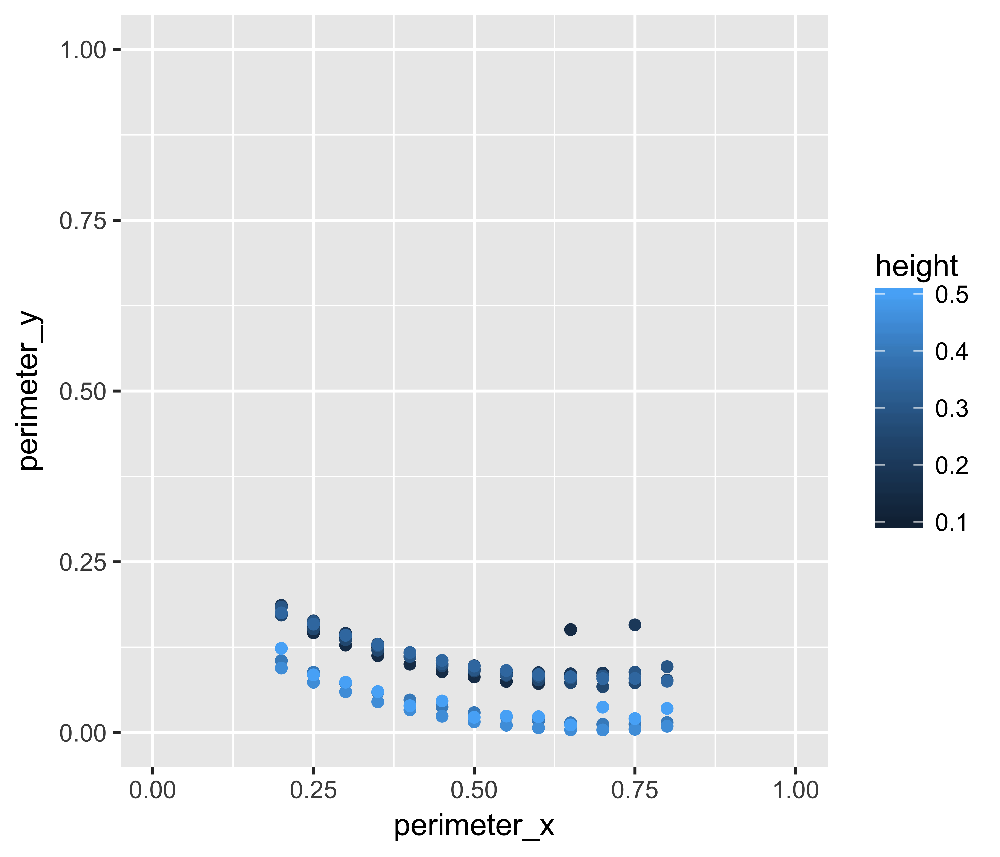

# Computer-Assisted Potsherd Classification

#### [Top](../README.md)

Find the center of the base, i.e., axis of rotation
---------------------------------------------------

    ## Loading required package: rgl

    ## Loading required package: ggplot2

    ## Loading required package: grid

    ## Loading required package: gridExtra

    ## Loading required package: purrr

    ## Loading required package: tibble

    ## Loading required package: lattice

#### Retrieve Saved Perimeter Data

``` r
perimeter_data <- readRDS( PERIMETER_FILE )
```

#### Plot perimeter data


\#\#\#\# Choose two points along the perimeter of the pot at the selected height(s)

``` r
# Choose a height, from which to estimate the axis of rotation
selected_height_index <- 4 # length( heights )

find_center <- function( p, h ){

  # Extract perimeter points at height, h
  perimeter <- p[ p[ , 'height' ] == h, c( 'perimeter_x', 'perimeter_y' ) ]
  
  # If an insufficient number of perimeter points exist at height, h, return result unknown,
  # otherwise, find the center and radius
  if( nrow( perimeter ) > 2 ){
  
    # Calculate the slope of each segment defined by each consecutive pair of perimeter points
    delta_y <- 2:nrow( perimeter ) %>%  map_dbl( ~perimeter[ .x, Y_AXIS ] - perimeter[ .x-1, Y_AXIS ] )
    delta_x <- 2:nrow( perimeter ) %>%  map_dbl( ~perimeter[ .x, X_AXIS ] - perimeter[ .x-1, X_AXIS ] )
    slopes <- delta_y / delta_x
    slopes
    N <- length( slopes )
    ray1 <- get_perpendicular2D( m = slopes[ 1 ], P = perimeter[ 2, ] )
    ray2 <- get_perpendicular2D( m = slopes[ N ], P = perimeter[ N-1, ] )
    est_ctr <- get_intersection2D( ray1, ray2 )
    est_radius <- euclidean_distance( est_ctr, perimeter[ 2, ] )
    result <- data.frame(
      h = h, ctrX = est_ctr$x, ctrY = est_ctr$y, r = est_radius
    )
  } else {
    result <- data.frame(
      h = h, ctrX = NA, ctrY = NA, r = NA
    )
  }
  lapply( result[ complete.cases( result ), ], round, 2 )
}

heights %>% map_df( ~find_center( perimeter_data, . )) -> radii
radii
```

    ## # A tibble: 9 x 4
    ##       h  ctrX  ctrY     r
    ##   <dbl> <dbl> <dbl> <dbl>
    ## 1  0.10  0.49  0.67  0.56
    ## 2  0.15  0.33  0.21  0.09
    ## 3  0.20  0.32  0.32  0.17
    ## 4  0.25  0.62  1.07  0.99
    ## 5  0.30  0.57  0.92  0.82
    ## 6  0.35  0.86  2.01  1.94
    ## 7  0.40  0.64  1.23  1.21
    ## 8  0.45  0.62  0.95  0.95
    ## 9  0.50  0.56  0.49  0.51

``` r
saveRDS( file = 'radii.RDS', radii )
```

#### [Top](../README.md)
